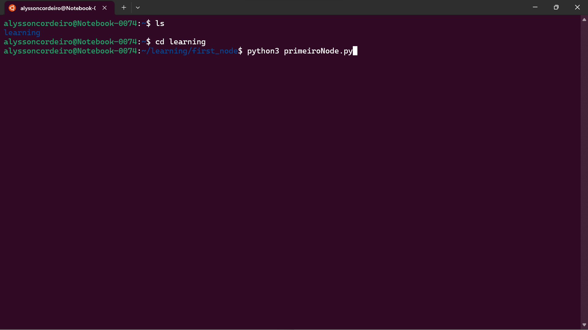
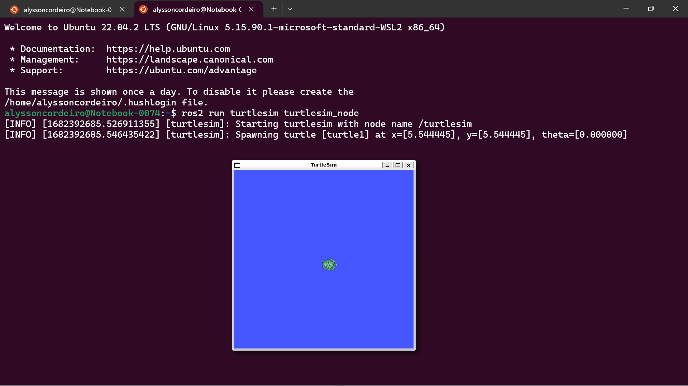

# **Turtle Doc**

#### Autor: Alysson Cordeiro.
#### Engenharia da Computação - Módulo 6.

#### -


# Turtlesim
## Simulando um ambiente robótico integrado no ROS.

#### --

### *OBJETIVO*:
Desenvolver um script em Python capaz de interagir com o nó de simulação do turtlesim e enviar mensagens nos tópicos que regem a locomoção da tartaruga principal. Além disso, deverá utilizar esse script para reproduzir um desenho de autoria própria.

### *PADRÃO DE QUALIDADE*:
Demonstrar a interação com o sistema operacional de robôs, criando um nó de comunicação com uma solução pré-existente.

### *LINGUAGEM USADA*:
- Python.

### *TECNOLOGIAS USADAS*:
- Visual Code Studio.
- Ubuntu.
- WSL.
- TurtleSim ROS.
- ROS3 Humble.


### *MODO DE INSTALAÇÃO*:
**1. Baixe o Ubuntu 22.04 (ambiente do subsistema Linux para Windows).**
 -  Acesse o link aqui: [Ubuntu](https://ubuntu.com/tutorials/install-ubuntu-on-wsl2-on-windows-11-with-gui-support#1-overview)  
 - Leia atentamente seguindo o passo a passo da documentação oficial do programa, desde da **visão geral** até **configuração do Ubuntu**.

#### ---

**2. Instalando os pacotes do ROS2: Humble**
 - Acesse o link e siga as instruções recomendadas aqui: [Documentação do ROS 2: Humilde](https://docs.ros.org/en/humble/Installation/Ubuntu-Install-Debians.html)
 - **Leia atentamente e siga o passo a passo da documentação oficial do programa, desde da DEFINIÇÃO DA LOCALIDADE até CONFIGURÇÃO DO AMBIENTE, pois este que fornece o script de configuração.**

#### ---

### *VAMOS FAZER A IMPLEMENTAÇÃO? SIGA O PASSO A PASSO.*
**1. Abra seu VS CODE para escrever o código da tartaruga.**
### ---
nota: foi usado o seguinte código:


*LINHA SHEBANG: definição de qual interpretador de script será usado*
```
!/usr/bin/env python3
```

*importando os módulos necessários para criar o nó ROS e controlar a tartaruga.*
```
import rclpy
from rclpy.node import Node
from geometry_msgs.msg import Twist
import time
```

*Inicializando o nome do nó, criando o publisher, o time, a mensagem Twist e um contrlador.*
```
class TurtleController(Node):
    def __init__(self):
        super().__init__('turtle_controller')
        print("funciona?")
        self.publisher_ = self.create_publisher(Twist, 'turtle1/cmd_vel', 10)
        self.timer_ = self.create_timer(0.1, self.move_turtle)
        self.twist_msg_ = Twist()
        self.counter = 0

```

*movimento hexagonal da tartaruga.*
```
    def move_turtle(self):
        if self.counter < 5: # altere o valor aqui para o número de vezes que deseja desenhar o triângulo
            for i in range(3):
                self.twist_msg_.linear.x = 3.0 #tamanho da área que a tartaruga irá pecorrer.
                self.publisher_.publish(self.twist_msg_)
                time.sleep(1.0)
                self.twist_msg_.linear.x = 0.0
                self.twist_msg_.angular.z = 1.0
                self.publisher_.publish(self.twist_msg_)
                time.sleep(1.5)
                self.twist_msg_.angular.z = 0.0
            self.counter += 1
        else:
            self.twist_msg_.linear.x = 0.0
            self.twist_msg_.angular.z = 0.0
            self.publisher_.publish(self.twist_msg_)
```


*função inicialização do ROS e o nó, executando o loop de eventos do ROS e deligando o nó quando o loop é interrompido.*
```
def main(args=None):
    rclpy.init()
    turtle_controller = TurtleController()
    rclpy.spin(turtle_controller)
    turtle_controller.destroy_node()
    rclpy.shutdown()
```
    
*verificação se o comando é um programa principal.*
```
if __name__ == '__main__':
    main()
```

**2. Abra o terminal Ubuntu e crie um usuário e uma senha.**


**3. Crie um repositório**

**4. Como de exemplo, criei um repositório ""learning"" e "first_node". Nesse repositório que ficará o código. E instale, respectivamente, estes comandos:**

- sudo apt update;
- sudo apt upgrade;
- sudo apt install ros-humble-desktop;
- source /opt/ros/humble/setup.bash

obs: este ultimo é essencial, pois instala a versão do ROS.

**5.  Abra o repostório onde está o código principal. Obs: Eu nomei o código de "primeiroNode.py". Então ainda no Ubuntu, execute o comando: "python3 primeiroNode.py". E aperte enter. Já está funcionando, porém não está aparencendo porque ainda não configuramos totalmente o simulador.**



 "*Lembrando: os ultimos passos só irá funcionar se seguiu todo os passos das duas documentações oficiais de instalação, deixado nos links mencionado acima*"


**6. Volte a Vs Code e instale as extensão: Remote - SSH e o WSL** 

**7. Abra o terminal do Visual Code e digite: "python3 primeiroNode.py" e já está funcionando também.**
 
[imagem](img/vscode.png)

**8. Volte ao Ubuntu e criei outra janela paralela a já existente. Digite: "ros2 run turtlesim turtlesim_node" para rodar o Turtlesim.** 


**9. Pronto, agora a tartaruga vai desenhar sua trajetória que foi escrita pelo script criado.** 